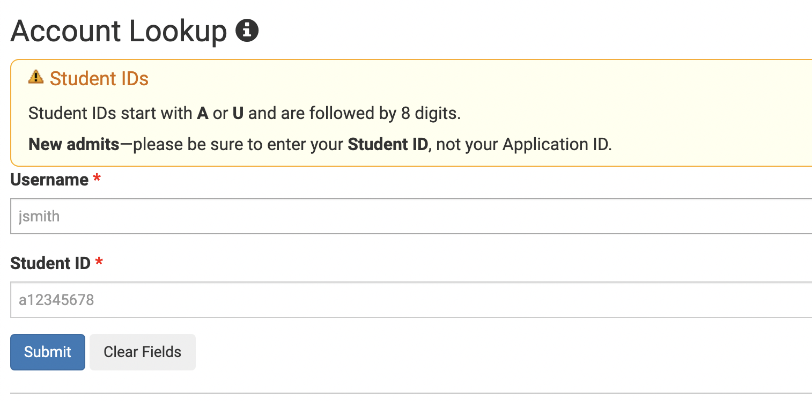
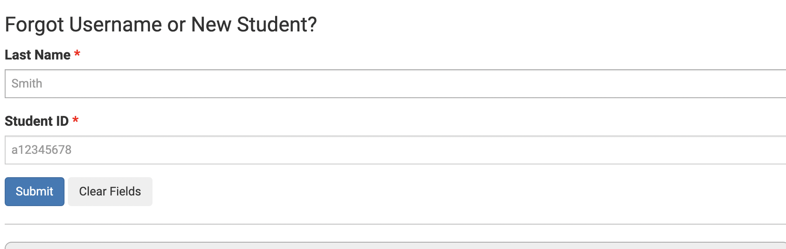
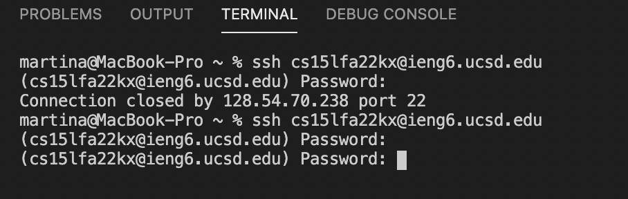
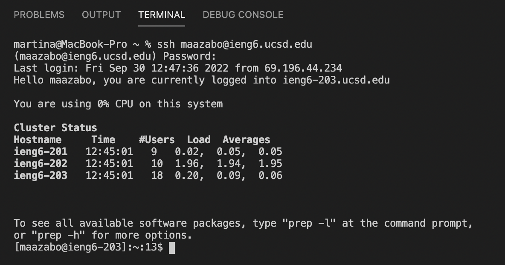
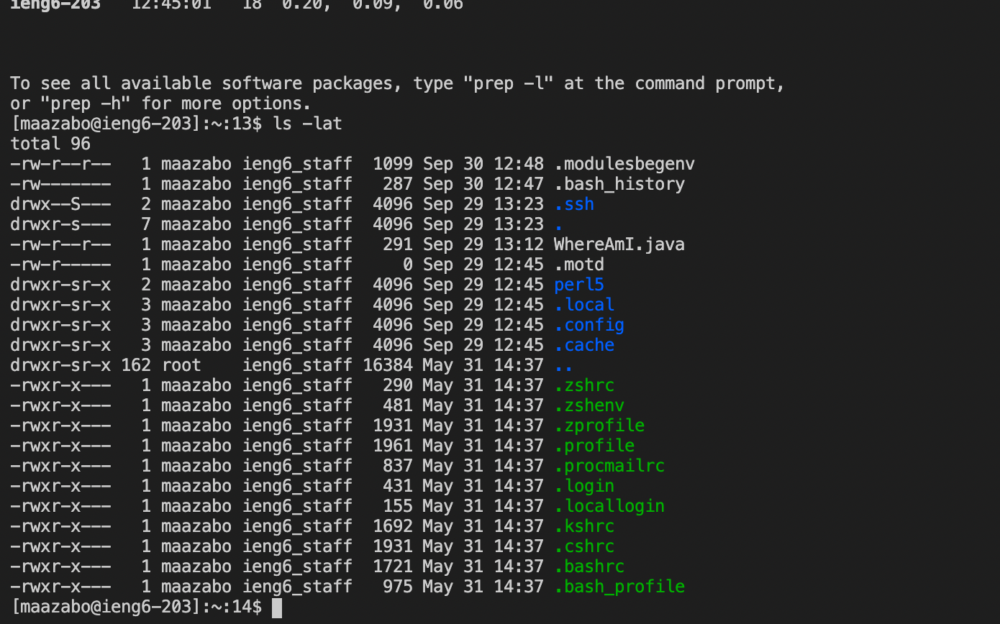

# *Hello Everyone!*

## **Step 1**
Your first step is to look up your course-specific account using the website [lxink](https://sdacs.ucsd.edu/~icc/index.php). This will show you all your accounts that you will possibily have in your CSE courses. 

## **Step 2.5**
Make sure you know your password to your account! It is usually the one you use for your TritionLink but if you are having difficulty, then you can change your password with this link [link](https://password.ucsd.edu/) and you will be prompted to follow the steps displayed or use this page to find out your course-specific account name. [link](https://sdacs.ucsd.edu/~icc/index.php)

## **Step 2** 
Make that you have VS code installed before. Open up your terminal in VS code using the terminal tab in the top right corner. This will allow you to login into your course-specific account using the command ssh cs15lfa22XX@ieng6.ucsd.edu while replacing the XX with the letters associated with your account. 

## **Step 3**
If you are struggling to login in using the CSE email, don't panic! This has happened to me and plenty of other people so you're not alone! Try using your normal UCSD email and the password that you use for it! 

This is the biggest obstacle that I faced while doing this lab and it took me over 15 - 20 minutes to figure out what to do. Ultimately, my TA suggested using our UCSD email and that's what worked out!

## **Step 3** 
After you typed "Yes", you will now become the "client" while the computer that you connected to in the CSE basement will be called the server. Now you can run commands to test it out!

Try out these commands: 
*ls -lat
*ls -a
*cd
*cd ~

